# 4.3 数据库设计

## 4.3.1 数据库概念结构设计

建议按照以下流程进行设计：找出所有的数据实体（不依赖于其他内容就可以独立存在的，用于描述某个实物或者事件的存在），确定各个实体所涉及到的数据属性，画出各个实体的实体属性图，然后找出所有实体之间的联系，画出全局E-R图。

### 1. 实体属性分析

#### （1）用户实体（user）

用户实体用于存储系统中所有用户的基本账号信息，包含普通用户、家政阿姨和管理员三种角色。用户实体包含id、phone、password_hash、role、status、created_at、updated_at等属性，其中id是主键。实体属性图如图4-1所示。

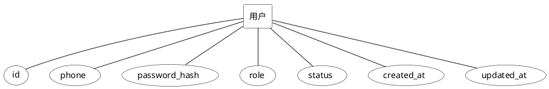

**图4-1 用户实体属性图**

#### （2）用户资料实体（user_profile）

用户资料实体用于存储用户的详细个人信息，与用户实体形成一对一的关系。用户资料实体包含user_id、name、gender、birthday、avatar、email、address等属性，其中user_id既是主键也是外键。实体属性图如图4-2所示。

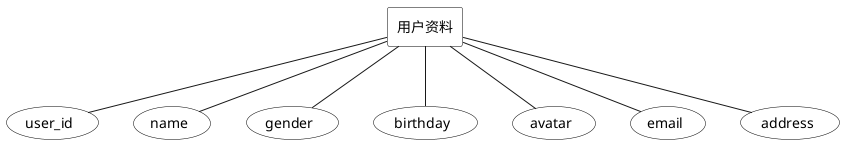

**图4-2 用户资料实体属性图**

#### （3）用户地址实体（user_address）

用户地址实体用于存储用户的收货地址信息，一个用户可以拥有多个地址。用户地址实体包含id、user_id、contact_name、contact_phone、province、city、district、detail、is_default、created_at等属性，其中id是主键。实体属性图如图4-3所示。

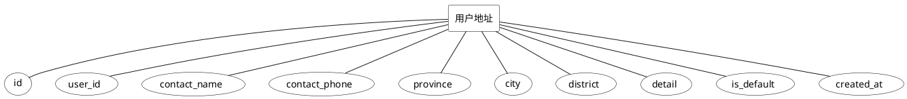

**图4-3 用户地址实体属性图**

#### （4）阿姨实体（worker）

阿姨实体用于存储家政服务人员的专业信息，与用户实体形成一对一的关系。阿姨实体包含id、user_id、level、years、bio、score、status等属性，其中id是主键。实体属性图如图4-4所示。

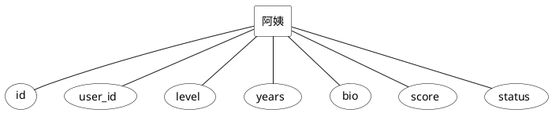

**图4-4 阿姨实体属性图**

#### （5）阿姨档期实体（worker_schedule）

阿姨档期实体用于记录家政阿姨的工作时间安排，便于用户预约和系统调度。阿姨档期实体包含id、worker_id、date、time_slot、status、created_at等属性，其中id是主键。实体属性图如图4-5所示。

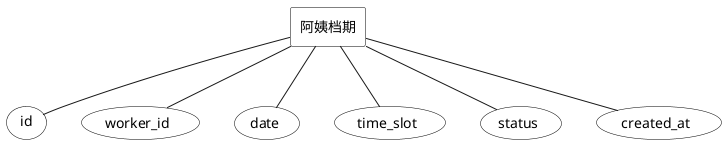

**图4-5 阿姨档期实体属性图**

#### （6）服务类目实体（service_category）

服务类目实体用于对家政服务进行分类管理，支持树形结构的分类体系。服务类目实体包含id、parent_id、name、sort等属性，其中id是主键，parent_id用于实现自关联的树形结构。实体属性图如图4-6所示。

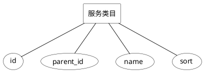

**图4-6 服务类目实体属性图**

#### （7）服务实体（service）

服务实体用于存储系统提供的各类家政服务信息。服务实体包含id、category_id、name、description、base_price、unit、status、hot、rating、created_at等属性，其中id是主键。实体属性图如图4-7所示。

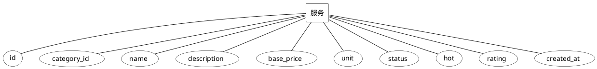

**图4-7 服务实体属性图**

#### （8）订单实体（order）

订单实体是系统的核心实体，用于记录用户预约家政服务的详细信息。订单实体包含id、order_no、customer_id、worker_id、service_id、schedule_date、time_slot、address_id、address_text、amount、status、remark、created_at、updated_at等属性，其中id是主键。实体属性图如图4-8所示。

```plantuml
@startuml
skinparam backgroundColor white
skinparam shadowing false
skinparam rectangle {
    BackgroundColor white
    BorderColor black
}
skinparam usecase {
    BackgroundColor white
    BorderColor black
}

rectangle "订单" as center

usecase "id" as id
usecase "order_no" as orderNo
usecase "customer_id" as customerId
usecase "worker_id" as workerId
usecase "service_id" as serviceId
usecase "schedule_date" as scheduleDate
usecase "time_slot" as timeSlot
usecase "address_id" as addressId
usecase "address_text" as addressText
usecase "amount" as amount
usecase "status" as status
usecase "remark" as remark
usecase "created_at" as createdAt
usecase "updated_at" as updatedAt

center -- id
center -- orderNo
center -- customerId
center -- workerId
center -- serviceId
center -- scheduleDate
center -- timeSlot
center -- addressId
center -- addressText
center -- amount
center -- status
center -- remark
center -- createdAt
center -- updatedAt
@enduml
```

**图4-8 订单实体属性图**

#### （9）订单日志实体（order_log）

订单日志实体用于记录订单状态变更的历史记录，便于追踪订单流转过程。订单日志实体包含id、order_id、from_status、to_status、op_by、note、created_at等属性，其中id是主键。实体属性图如图4-9所示。

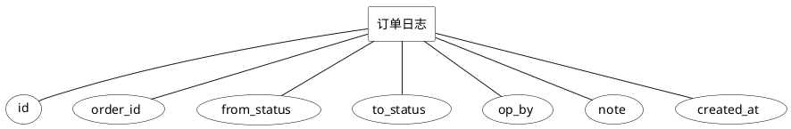

**图4-9 订单日志实体属性图**

#### （10）评价实体（review）

评价实体用于存储用户对已完成订单的评价信息。评价实体包含id、order_id、rating、content、imgs、created_by、created_at等属性，其中id是主键。实体属性图如图4-10所示。

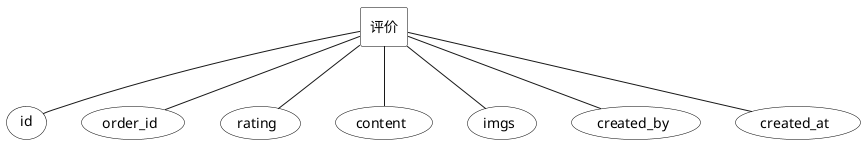

**图4-10 评价实体属性图**

### 2. 实体间联系分析

根据上述实体分析，可以确定各实体之间的联系如下：

1. **user与user_profile**：一对一关系（1:1），每个用户对应一条用户资料记录。
2. **user与user_address**：一对多关系（1:N），一个用户可以有多个收货地址。
3. **user与worker**：一对一关系（1:1），一个用户可以成为一名阿姨。
4. **worker与worker_schedule**：一对多关系（1:N），一名阿姨可以设置多个档期。
5. **service_category自关联**：一对多关系（1:N），支持多级分类结构。
6. **service_category与service**：一对多关系（1:N），一个类目下可以有多个服务。
7. **user与order**（作为客户）：一对多关系（1:N），一个用户可以下多个订单。
8. **worker与order**（作为服务者）：一对多关系（1:N），一名阿姨可以服务多个订单。
9. **service与order**：一对多关系（1:N），一种服务可以被多次预约。
10. **user_address与order**：一对多关系（1:N），一个地址可以用于多个订单。
11. **order与order_log**：一对多关系（1:N），一个订单可以有多条状态变更记录。
12. **order与review**：一对一关系（1:1），一个订单对应一条评价记录。
13. **user与order_log**（作为操作人）：一对多关系（1:N），一个用户可以操作多条日志。
14. **user与review**（作为创建人）：一对多关系（1:N），一个用户可以发表多条评价。

### 3. 全局E-R图

根据以上实体和联系分析，绘制系统全局E-R图如图4-11所示。

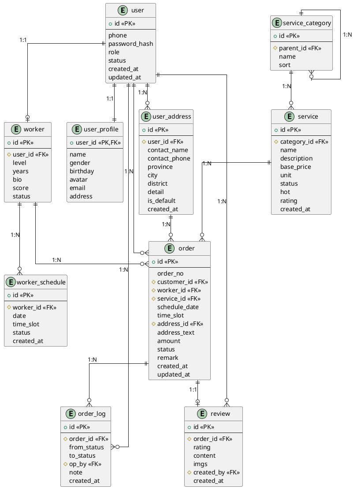

**图4-11 系统全局E-R图**
