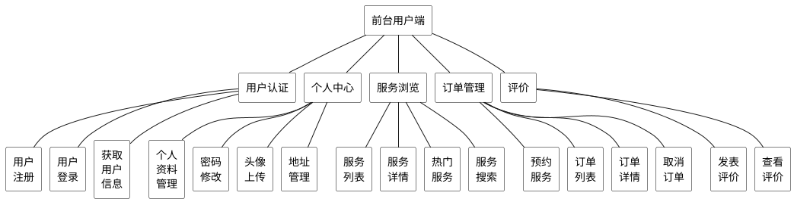
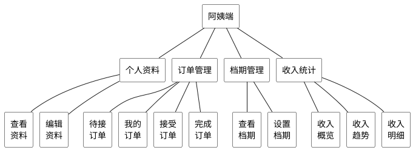

## 4.1 系统功能结构设计

根据第三章需求分析的结果，贝贝家政服务系统开发决定遵循JavaEE的开发规范，系统设计为前后端分离架构。将系统设计为前后端分离架构的目的是实现前端展示层与后端业务逻辑层的解耦，前端可以独立部署和迭代，后端专注于业务处理和数据管理，两者通过RESTful API进行通信，从而提高开发效率、便于团队协作，并增强系统的可维护性和可扩展性。系统总体功能将拆分为多个功能模块，合理的模块拆分能够使各模块职责明确、边界清晰，如果拆分过多会导致模块间调用关系复杂，增加系统耦合度；如果拆分过少则会造成单个模块功能臃肿，不利于代码维护和功能扩展。根据本系统需求分析的结果和高内聚、低耦合的拆分原则，将系统的功能部分拆分为前台用户端和后台管理系统两大部分。

### 4.1.1 前台用户端功能结构

前台用户端主要面向需要预约家政服务的普通用户，系统功能结构分为用户认证模块、个人中心模块、服务浏览模块、订单管理模块和评价模块五大功能模块。其中个人中心模块又包括个人资料管理、密码修改、头像上传、地址管理等子模块。前台用户端功能模块图如图4.1所示。

图4.1 前台用户端功能模块图

### 4.1.2 后台管理系统功能结构

本系统的后台管理系统主要满足管理员和家政服务人员（阿姨）两类角色的使用需求。管理员需要对平台用户、阿姨、服务项目、订单进行全面管理，并查看平台运营数据统计；家政服务人员需要管理个人资料、查看和处理订单、设置工作档期以及查看收入情况。

#### 管理员端功能结构

管理员端具体功能结构设计为用户管理模块、阿姨管理模块、服务管理模块、订单管理模块和数据统计模块五大功能模块。其中用户管理模块又包括用户列表、用户详情、状态管理、角色管理、密码重置等子模块。管理员端功能模块图如图4.2所示。

```plantuml
@startuml
skinparam BackgroundColor white
skinparam defaultFontName Microsoft YaHei
skinparam ranksep 50
skinparam nodesep 10
skinparam rectangle {
    BackgroundColor white
    BorderColor black
}

together {
    rectangle "用户管理" as m1
    rectangle "阿姨管理" as m2
    rectangle "服务管理" as m3
    rectangle "订单管理" as m4
    rectangle "数据统计" as m5
}

rectangle "后台管理系统" as root

together {
    rectangle "用户\n列表" as m1_1
    rectangle "用户\n详情" as m1_2
    rectangle "状态\n管理" as m1_3
    rectangle "角色\n管理" as m1_4
    rectangle "密码\n重置" as m1_5
}

together {
    rectangle "阿姨\n列表" as m2_1
    rectangle "新增\n阿姨" as m2_2
    rectangle "阿姨\n详情" as m2_3
    rectangle "状态\n管理" as m2_4
    rectangle "等级\n管理" as m2_5
}

together {
    rectangle "服务\n列表" as m3_1
    rectangle "新增\n服务" as m3_2
    rectangle "编辑\n服务" as m3_3
    rectangle "删除\n服务" as m3_4
    rectangle "热门\n设置" as m3_5
}

together {
    rectangle "订单\n列表" as m4_1
    rectangle "订单\n详情" as m4_2
    rectangle "订单\n分配" as m4_3
    rectangle "订单\n统计" as m4_4
}

together {
    rectangle "平台\n概览" as m5_1
    rectangle "订单\n趋势" as m5_2
    rectangle "服务\n统计" as m5_3
    rectangle "用户\n统计" as m5_4
    rectangle "阿姨\n统计" as m5_5
}

root -down- m1
root -down- m2
root -down- m3
root -down- m4
root -down- m5

m1 -down- m1_1
m1 -down- m1_2
m1 -down- m1_3
m1 -down- m1_4
m1 -down- m1_5

m2 -down- m2_1
m2 -down- m2_2
m2 -down- m2_3
m2 -down- m2_4
m2 -down- m2_5

m3 -down- m3_1
m3 -down- m3_2
m3 -down- m3_3
m3 -down- m3_4
m3 -down- m3_5

m4 -down- m4_1
m4 -down- m4_2
m4 -down- m4_3
m4 -down- m4_4

m5 -down- m5_1
m5 -down- m5_2
m5 -down- m5_3
m5 -down- m5_4
m5 -down- m5_5

m1 -[hidden]right- m2
m2 -[hidden]right- m3
m3 -[hidden]right- m4
m4 -[hidden]right- m5

m1_1 -[hidden]right- m1_2
m1_2 -[hidden]right- m1_3
m1_3 -[hidden]right- m1_4
m1_4 -[hidden]right- m1_5

m2_1 -[hidden]right- m2_2
m2_2 -[hidden]right- m2_3
m2_3 -[hidden]right- m2_4
m2_4 -[hidden]right- m2_5

m3_1 -[hidden]right- m3_2
m3_2 -[hidden]right- m3_3
m3_3 -[hidden]right- m3_4
m3_4 -[hidden]right- m3_5

m4_1 -[hidden]right- m4_2
m4_2 -[hidden]right- m4_3
m4_3 -[hidden]right- m4_4

m5_1 -[hidden]right- m5_2
m5_2 -[hidden]right- m5_3
m5_3 -[hidden]right- m5_4
m5_4 -[hidden]right- m5_5

@enduml
```

图4.2 后台管理系统功能模块图

#### 阿姨端功能结构

阿姨端具体功能结构设计为个人资料模块、订单管理模块、档期管理模块和收入统计模块四大功能模块。其中订单管理模块又包括待接订单、我的订单、接受订单、完成订单等子模块。阿姨端功能模块图如图4.3所示。

图4.3 阿姨端功能模块图
